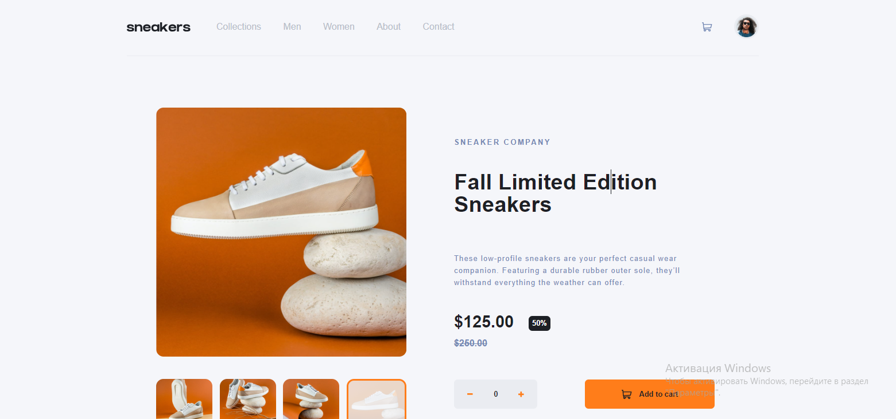

# Frontend Mentor - E-commerce product page solution

This is a solution to the [E-commerce product page challenge on Frontend Mentor](https://www.frontendmentor.io/challenges/ecommerce-product-page-UPsZ9MJp6).

## Overview

### The challenge

Users should be able to:

- View the optimal layout for the site depending on their device's screen size
- See hover states for all interactive elements on the page
- Open a lightbox gallery by clicking on the large product image
- Switch the large product image by clicking on the small thumbnail images
- Add items to the cart
- View the cart and remove items from it

### Screenshot

### Links

- Solution URL: [Add solution URL here](https://github.com/InnaTymoshenko/ecommerce-product-page)
- Live Site URL: [Add live site URL here](https://ecommerce-product-page-ten-lac.vercel.app/)

## My process

### Built with

- Semantic HTML5 markup
- CSS custom properties
- Flexbox
- TypeScript
- TailwindCSS
- [React](https://reactjs.org/) - JS library
- zustand
- Vite (npm run dev)

## Author

- Website - [Tymoshenko Inna](https://itymoshenko.vercel.app/)
- Frontend Mentor - [@InnaTymoshenko](https://www.frontendmentor.io/profile/InnaTymoshenko)
